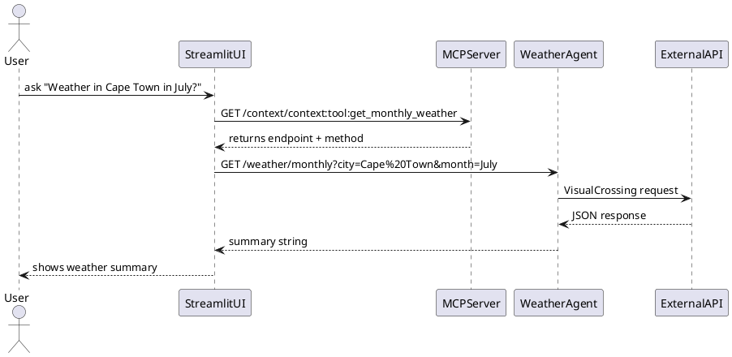

````markdown
# 🌦️ Weather Agent with Model Context Protocol (MCP)

[](https://www.python.org/)
[](https://fastapi.tiangolo.com/)
[](https://streamlit.io/)
[](https://opensource.org/licenses/MIT)

> A modular AI-ready agent that answers weather-related queries, integrated with an Anthropic-style **Model Context Protocol (MCP)** registry.

---

## 🧠 What It Does

- 🌐 Provides real-time and historical weather data
- 🧱 Uses a **Model Context Protocol** (MCP) server to register and resolve tools
- 🧠 Powered by OpenWeatherMap + VisualCrossing APIs
- 🎛️ Streamlit UI to ask natural questions like  
  > *“What’s the weather in Tokyo in March?”*

---

## 📐 Architecture Diagram


weather-agent-mcp/
├── weather_agent.py         # FastAPI weather microservice
├── tools.py                 # Logic for live/monthly weather APIs
├── welcome.py               # Streamlit UI client
├── mcp_server.py            # MCP registry server
├── register_tools.py        # Tool registration script
├── Dockerfile               # [NEW] Docker support
├── docker-compose.yml       # [NEW] Multi-service runner
├── requirements.txt         # Python dependencies
└── README.md                # You're reading it 🙂
```

---

## 🚀 Quick Start

### ▶️ Option 1: Run Locally (Manual)

```bash
# 1. Install dependencies
pip install -r requirements.txt

# 2. Run MCP server (port 8100)
uvicorn mcp_server:app --reload --port 8100

# 3. Run weather agent (port 8000)
uvicorn weather_agent:app --reload --port 8000

# 4. Register tools
python register_tools.py

# 5. Launch UI
streamlit run welcome.py
```

---

### 🐳 Option 2: Run via Docker

```bash
# Build and run all services
docker-compose up --build
```

Access the UI at: [http://localhost:8501](http://localhost:8501)

---

## 🔧 MCP Endpoints (Exposed at `http://localhost:8100`)

| Method | Endpoint        | Description                      |
| ------ | --------------- | -------------------------------- |
| POST   | `/register`     | Register a new tool/context node |
| GET    | `/context/{id}` | Get context node by ID           |
| GET    | `/context`      | List all registered nodes        |
| POST   | `/resolve`      | Resolve multiple IDs in a bundle |

---

## 🌤️ Registered Tools

| Tool ID                            | Description                               |
| ---------------------------------- | ----------------------------------------- |
| `context:tool:get_live_weather`    | Gets live temperature from OpenWeatherMap |
| `context:tool:get_monthly_weather` | Gets monthly averages from VisualCrossing |

Registered via `register_tools.py` and served by `weather_agent.py`.

---

## 📦 `requirements.txt`

```txt
fastapi
uvicorn
pydantic
requests
streamlit
```

---

## 🐾 Example Queries

> *"What's the temperature in Delhi?"*
> *"How is the weather in Cape Town in July?"*
> *"Forecast in Tokyo?"*

---

## 🛠️ Coming Soon

* [ ] Redis-backed persistent MCP context store
* [ ] Secure API key management for external services
* [ ] OAuth-authenticated user sessions in Streamlit

---

## 🐾 Log Trace

Sample Logs:
[User Input] How is the weather in Cape Town in July?
[Perception] Parsed city: cape town, month: july
[MCP Lookup] Tool ID selected: context:tool:get_monthly_weather
[MCP Resolution] Resolved endpoint: http://localhost:8000/weather/monthly, method: GET
[Tool Request] Params: {'city': 'cape town', 'month': 'july'}
[Weather Agent] Received monthly weather request for city: cape town, month: july
[Monthly Weather] Fetching weather for: cape town in july
[Monthly Weather] Avg Temp: 15.6, Common: Partly Cloudy
[Tool Response] Status: 200

## 💉 CURL
Curl for registering Node:
```bash
curl -X POST http://localhost:8100/register \
  -H "Content-Type: application/json" \
  -d '{
    "id": "context:tool:get_live_weather",
    "type": "tool",
    "name": "Live Weather",
    "description": "Provides live weather for a given city using OpenWeatherMap.",
    "content": {
      "endpoint": "http://localhost:8000/weather/live",
      "method": "GET",
      "params": {
        "city": "City name"
      }
    }
  }'
```


## 📃 License

MIT © 2025 [Vaibhav Kashyap](https://github.com/your-handle)

```

---

### ✅ Also includes:

- `Dockerfile` for MCP + weather agent
- `docker-compose.yml` to run it all together (can be generated on request)
```
